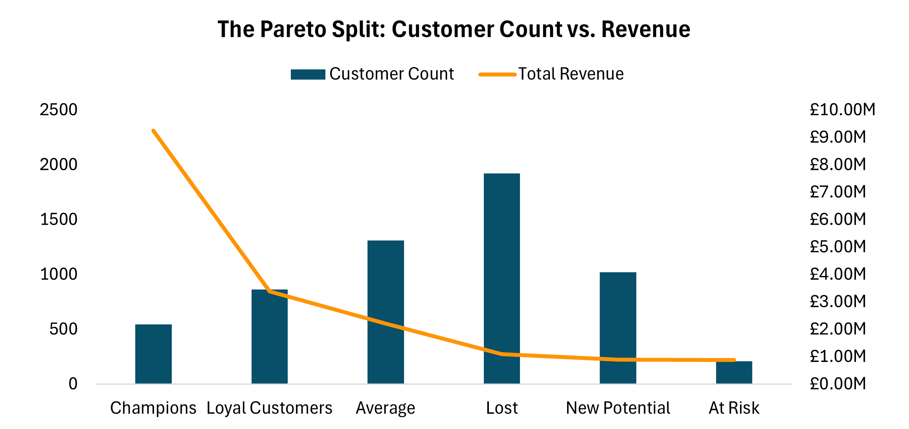
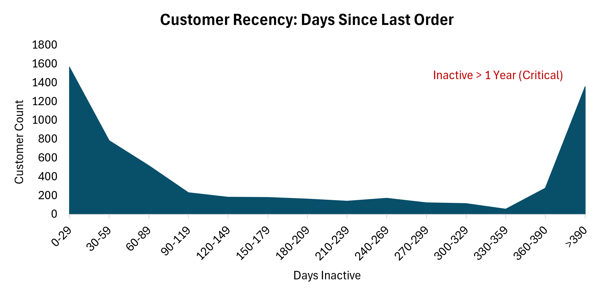
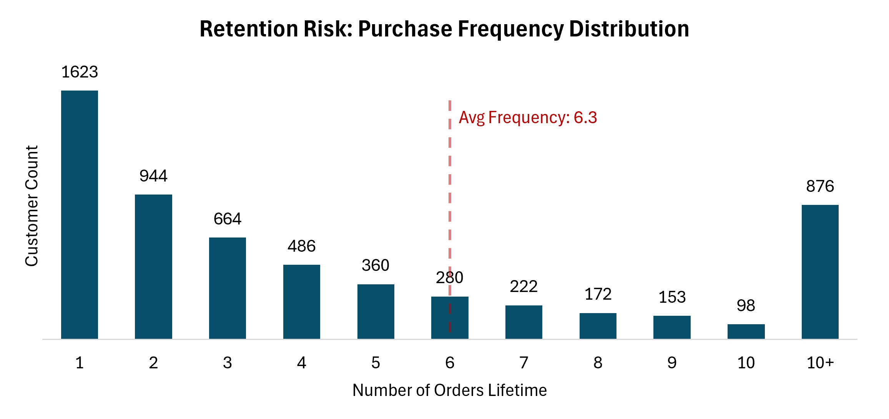
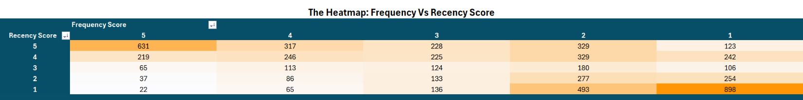

# 🛒 Ecommerce RFM Segmentation And Retention Strategy


## 📋 Table of Contents

* [Project Overview](#project-overview)
* [Business Problem](#business-problem)
* [Data Source & Processing](#data-source--processing)
* [The "Customer Decoder" Model (Methodology)](#the-customer-decoder-model-methodology)
* [Technical Implementation (Code Snippets)](#technical-implementation-code-snippets)
* [Key Insights & Visuals](#key-insights--visuals)
* [Strategic Recommendations](#strategic-recommendations)
* [Repository Structure](#repository-structure)
* [How to Run This Project](#how-to-run-this-project)
* [Author](#author)

## 📖 Project Overview

This project transforms raw sales data into a strategic **Customer Segmentation Report** using the **RFM (Recency, Frequency, Monetary)** model. 

Built entirely in Excel, the report moves beyond simple sales metrics to analyze *customer behavior*. It identifies distinct customer groups—from high-value "Champions" to "At Risk" churners—and provides data-driven recommendations to improve Customer Lifetime Value (CLV) and retention rates.

## 💼 Business Problem

**The Scenario:**
An online retail business operating in the UK (with international sales) is experiencing high transaction volume but lacks visibility into customer retention. 

**The Challenge:**
* **Invisible Churn:** The company has 2 years of data but no way to track when a loyal customer stops buying.
* **One-Size-Fits-All Marketing:** Marketing budget is wasted treating VIPs and one-time buyers exactly the same.
* **Missed Revenue:** "High Potential" customers are being acquired but are leaving after a single purchase.

**The Goal:**

To build a "Customer Decoder" that answers:
1.  Who are our most valuable customers?
2.  Where is the biggest leak in our retention funnel?
3.  Which customers are at risk of churning right now?

## 💾 Data Source & Processing

**Note:** The raw dataset is not included in this repository due to size constraints. You can download it directly from the source below.

* **Source:** [Online Retail II UCI on Kaggle](https://www.kaggle.com/datasets/mashlyn/online-retail-ii-uci)
* **Dataset Info:** 1,067,372 Rows of transactional data.
* **Time Period:** 2009-2011.

**Data Cleaning (Power Query):**
Raw data was processed using Excel's Power Query (M Code) to ensure accuracy:
* **Filtering:** Removed `null` Customer IDs and cancelled orders (Negative Quantity/Price).
* **Transformation:** Converted InvoiceDate to Date type and calculated `Total Revenue` column.
* **Encoding:** Handled `QuoteStyle` to prevent CSV parsing errors.

## 🛠 The "Customer Decoder" Model (Methodology)

I engineered a custom **RFM Model** to score every customer on a scale of 1-5.

| Metric | Definition | Scoring Logic (1-5) |
| :--- | :--- | :--- |
| **Recency (R)** | Days since last purchase | **5** = Active (<30 days) ... **1** = Inactive (>365 days) |
| **Frequency (F)** | Total number of orders | **5** = High freq (>9 orders) ... **1** = One-time buyer |
| **Monetary (M)** | Total revenue generated | **5** = Top 20% of spenders (Percentile Rank) |

**Segmentation Logic:**
Using the R-F-M scores, customers were grouped into named segments:
* 🏆 **Champions (555):** Bought recently, buy often, and spend the most.
* 💖 **Loyal Customers:** High Recency (R>=4) and Frequency (F>=4).
* 🌟 **New Potential:** High Recency (R>=4) but low Frequency (F<=2).
* ⚠️ **At Risk:** Low Recency (R<=2) but used to be frequent (F>=4).
* 💤 **Lost:** Low Recency and Frequency.

## 💻 Technical Implementation (Code Snippets)

<details>
<summary><strong>Click to view the Power Query (M Code) used for Data Cleaning</strong></summary>

I used Power Query to perform the ETL (Extract, Transform, Load) process. This script handles data type conversions and filters out invalid transactions (returns/cancellations).

```powerquery
let
    Source = Csv.Document(File.Contents("Your_File_Path"),[Delimiter=",", Columns=8, Encoding=1252, QuoteStyle=QuoteStyle.None]),
    #"Promoted Headers" = Table.PromoteHeaders(Source, [PromoteAllScalars=true]),
    #"Changed Type" = Table.TransformColumnTypes(#"Promoted Headers",{{"Invoice", type text}, {"StockCode", type text}, {"Description", type text}, {"Quantity", Int64.Type}, {"InvoiceDate", type datetime}, {"Price", Currency.Type}, {"Customer ID", Int64.Type}, {"Country", type text}}, "en-GB"),
    #"Filtered Rows" = Table.SelectRows(#"Changed Type", each ([Customer ID] <> null) and ([Quantity] > 0) and ([Price] > 0)),
    #"Added Custom" = Table.AddColumn(#"Filtered Rows", "Total Revenue", each [Quantity]*[Price]),
    #"Extracted Date" = Table.TransformColumns(#"Added Custom",{{"InvoiceDate", DateTime.Date, type date}})
in
    #"Extracted Date"
```
</details>

<details>
<summary><strong>Click to view the Excel Formulas for RFM Scoring</strong></summary>

I utilized `PERCENTRANK.INC` for dynamic Monetary scoring and nested `IFS` functions for segmentation logic.

**Monetary Score (1-5):**
```excel
=MIN(5, INT(PERCENTRANK.INC([Monetary (Total Spent)], [@[Monetary (Total Spent)]]) * 5) + 1)
```

**Customer Segmentation Logic:**
```excel
=IFS(
    [@[RFM_String]]="555", "Champions",
    AND([@[R_Score]]>=4, [@[F_Score]]>=4), "Loyal Customers",
    AND([@[R_Score]]>=4, [@[F_Score]]<=2), "New Potential",
    AND([@[R_Score]]<=2, [@[F_Score]]>=4), "At Risk",
    AND([@[R_Score]]<=2, [@[F_Score]]<=2), "Lost",
    TRUE, "Average"
)
```
</details>

## 📊 Key Insights & Visuals

### 1. The "Pareto" Revenue Driver
**Insight:** The business is heavily reliant on a tiny elite group. "Champions" represent only **9%** of the customer base but generate **52%** of Total Revenue (£9.26M).
* **Risk:** If these few customers leave, the business collapses.



---

### 2. High-Value Acquisition, Low Retention
**Insight:** Surprisingly, "New Potential" customers spend **more per order (£450)** than long-term "Loyal Customers" (£389).
* **Finding:** We are acquiring "High Rollers," but failing to keep them active.

_by_Segment.png)

---

### 3. The "Recency Drop-Off" (The Danger Zone)
**Insight:** Customer activity drops off sharply after the first 30 days. The critical "Danger Zone" is between **120–180 days**.
* **Risk:** Once a customer crosses the 180-day mark, they are statistically likely to become "Lost" forever.



---

### 4. The "One-Hit Wonder" Leak
**Insight:** The biggest retention leak happens immediately. **28% of customers (1,623)** purchase exactly once and never return.
* **Benchmark:** This is significantly below the average purchase frequency of 6.3 orders.



---

### 5. The "Migration Gap"
**Insight:** The Heatmap reveals a "missing middle class." Customers tend to polarize—they either become Super Champions (Scores 5-5) or they drift into the Lost segment (Scores 1-1).



## 🚀 Strategic Recommendations

Based on the data analysis, I recommend the following actions to improve retention and revenue:

1.  **Launch "VIP Concierge" for Champions**
    * **Why:** The top 9% of customers drive 52% of revenue.
    * **Action:** Create a velvet-rope program (early access, exclusive support) to lock them in.

2.  **"High Roller" Onboarding**
    * **Why:** "New Potential" users spend the most (£450) but churn early.
    * **Action:** Implement a specific post-purchase sequence for high-ticket items to ensure satisfaction and secure the second order.

3.  **Target the "Danger Zone" (120-180 Days)**
    * **Why:** Activity plummets after 4 months.
    * **Action:** Launch a "We Miss You" win-back campaign specifically for customers inactive for 120-180 days.

4.  **Automate "Second Purchase" Nudge**
    * **Why:** 28% of customers buy once and never return.
    * **Action:** Trigger a personalized discount email exactly **30 days** after the first purchase.

5.  **The "Tier Upgrade" Campaign**
    * **Why:** The "Middle Class" (Regulars) is thin.
    * **Action:** Target "Regular" customers (R-F scores of 3-3 and 4-4) with loyalty incentives to push them up into the "Champion" segment.

## 📂 Repository Structure

```text
├── assets/                                       # Images and GIFs used in this README
├── data/
│   └── raw/                                      # (Empty) Place the 'online_retail_II.csv' file here
├── E-Commerce_Customer_Segmentation_Report.xlsx  # The complete Excel project file
├── .gitignore                                    # Specifies files to exclude (large datasets)
└── README.md                                     # Project documentation

## ⚙️ How to Run This Project

Since this project relies on a local CSV file, you need to update the data connection path when you open it on your machine.

**1. Download the Data**
* Download the `online_retail_II.csv` file from [Kaggle](https://www.kaggle.com/datasets/mashlyn/online-retail-ii-uci).
* Save the file inside the `data/raw/` folder in this repository.

**2. Open the Project**
* Open `E-Commerce_Customer_Segmentation_Report.xlsx`.

**3. Update the Data Source**
* Go to the **Data** tab on the top ribbon.
* Click **Queries & Connections**.
* In the right-hand pane, right-click the `online_retail_II` query and select **Edit**.
* In the Power Query Editor, click the **Source** step (first step on the right).
* Change the file path to match the location of the CSV file on your computer.
* Click **Close & Load**.

**4. Refresh**
* Go to the **Data** tab and click **Refresh All** to reload the analysis.

## 👤 Author

**Zoran Gusic**
* [LinkedIn](https://www.linkedin.com/in/zoran-gusic-28910a242/)
* [Upwork](https://www.upwork.com/freelancers/~your-id)
* [GitHub](https://github.com/ZoranG99)

